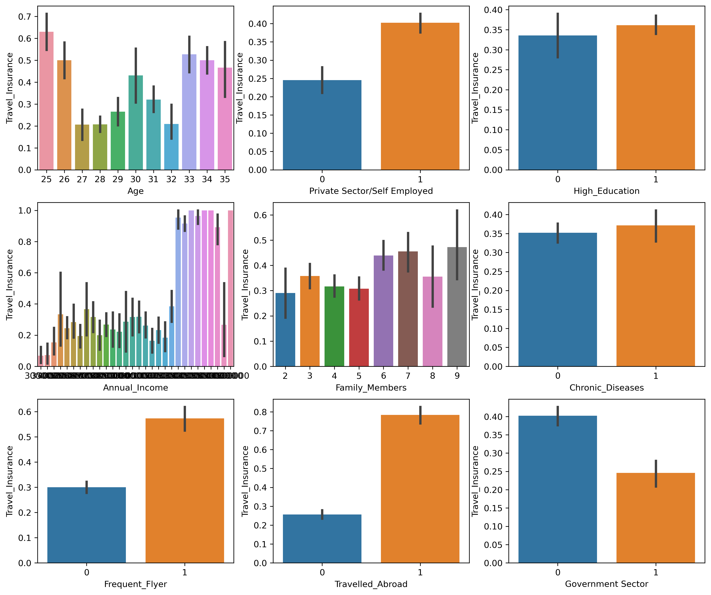
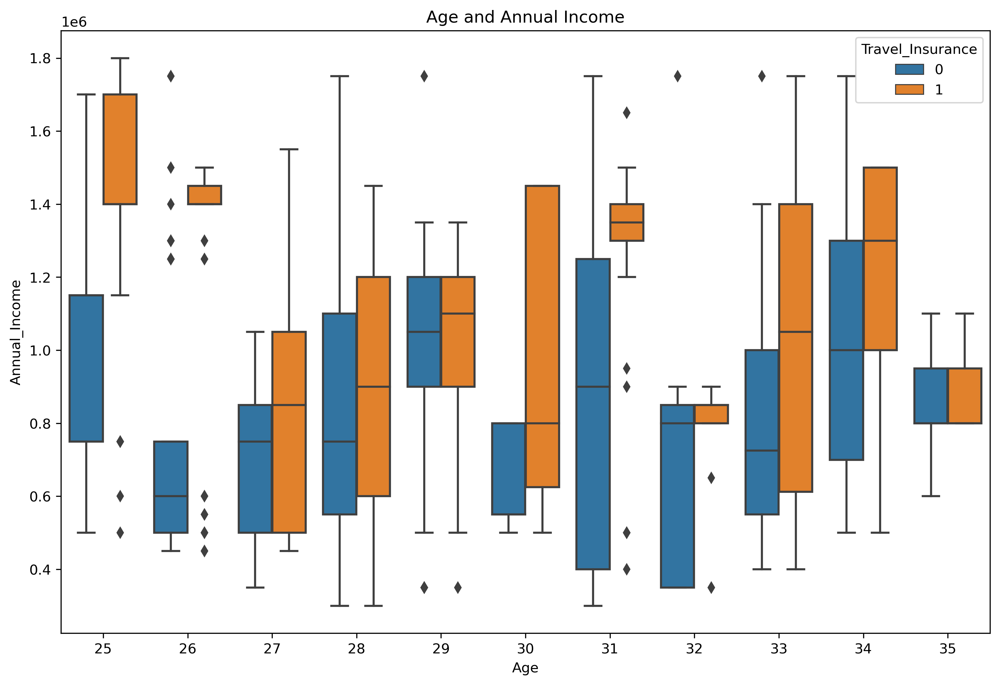
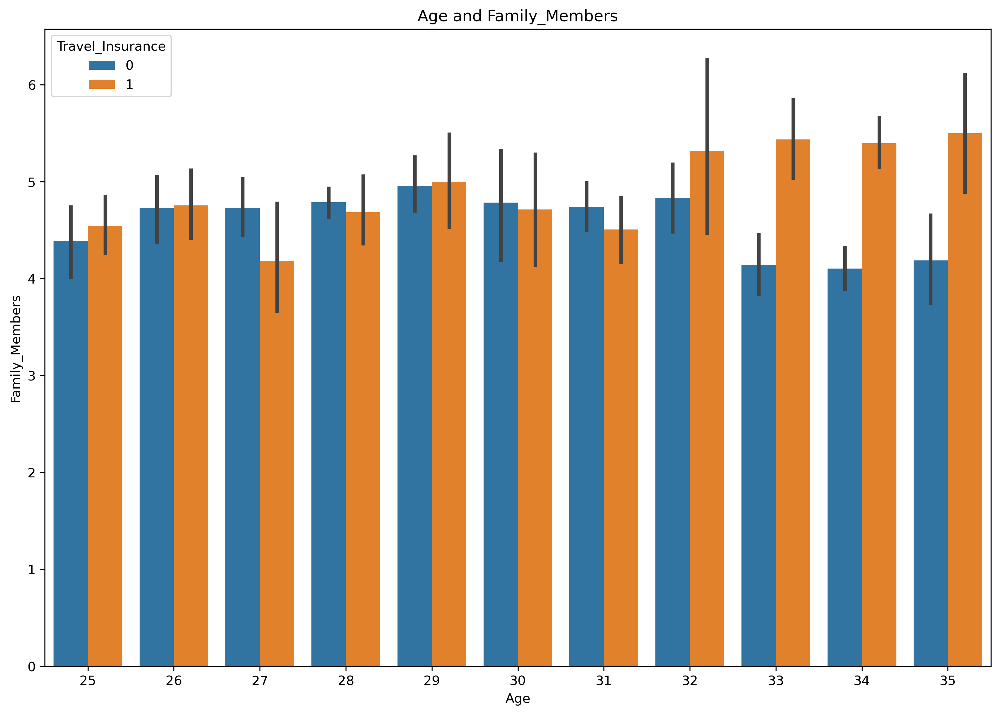
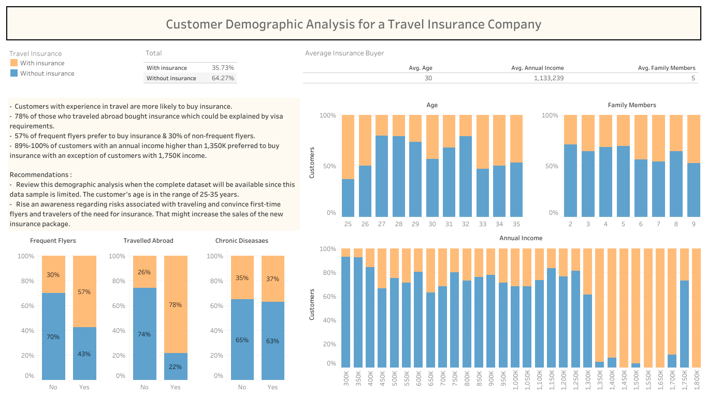

# Travel Insurance Prediction Project

[Data source](https://www.kaggle.com/tejashvi14/travel-insurance-prediction-data)

## Introduction

A Tour & Travels company is an Indian company which is offering travel insurance packages to their customers.
The insurance was offered to some of the customers during 2019 and the data has been extracted from the performance/sales of the package during that period. 
The data is provided for almost 2000 previous customers.

**Buisness problem**

The travel agency has seen reduced sales during the pandemic and now that travel is resuming the agency feels the need to offer COVID related travel insurance in order to stay relevant in the post-pandemic marketplace. 
The company’s current travel insurance package does not include coverage for COVID related trip cancellation or medical expenses. Offering COVID insurance could be a major differentiator for clients when deciding which travel agency to select for booking travel.
But before changing the insurance policy the company wants to know it's customer demographics and which customers would be interested in buying a new insurance packege based on the existing historical dataset.

### Goals of this project

-  Building a classification model that can predict if the customer will be interested to buy the travel insurance package.
-  Building a demographic portrait of an average insurance buyer using Tableau.

## Data Analysis

### Technologies

-  [**Google sheets**](https://docs.google.com/spreadsheets/d/1-pZdBVA_4dQfpvml7Upj4WPbqAWp1WXki2kXr4sXH94/edit?usp=sharing) for data cleaning. I used if statements to convert data into binary data type.
-  Data Exploration and Modeling was all done in **Python** using [**the Jupyter Notebook**](https://github.com/Fedotova-Elena/DataProtfolio/blob/main/Capstone%20Project/project_travel_prediction.ipynb).
-  [**Tableau**](https://public.tableau.com/views/CustomerDemographicsAnalysis/Dashboard2?:language=en-US&:display_count=n&:origin=viz_share_link) was used for a data visualisation.

### Methodology

-  Data pre-processing (handling of missing values, outliers, correlated features, etc.)
-  Graphical and non-graphical representations of relationships between dependant and independent variables)
-  Data splitting (training, validation, and test sets)
-  Validation and testing (model tuning and evaluation)
-  Results and final model selection (performance measures, etc.)
-  Making conclusions and recommendations

### What do we know about the customers?

-  Age - Age Of The Customer
-  Government Sector - The customer is employed in government sector
-  Private Sector/Self Employed - the customer is employed in private sector
-  High_Education - Whether the customer is a college graduate or not
-  Annual_Income - The yearly income of the customer in indian rupees [Rounded To Nearest 50 Thousand Rupees]
-  Family_Members - Number of members in customer's family
-  Chronic_Disease - Whether the customer suffers from any major disease or conditions like Diabetes/High BP or Asthma, etc.
-  Frequent_Flyer - Derived data based on customer's history of booking air tickets on at least 4 different instances in the last 2 years[2017-2019]
-  Travelled_Abroad - Has the Customer ever travelled to A foreign country[Not Necessarily Using The Company's Services]
-  Travel_Insurance - Did the customer buy travel insurance package during introductory offering held in the year 2019

### Research Questions

-  What is a travel insurance ratio in the data set?
-  What is the corelation between the family size, age, annual income and the travel insurance variable?
-  How annual income correlate with experience in traveling(flight frequency, travelling abroad) with regard to buying the insurance?
-  How the presence of chronic diseases influence the desicion of buyng the insurance?

### Important findings

At 25, there are more people buying the insurance. At 27-29, a lot more people decide not to buy insurance. It could be attributed to the expiry of the family insurance pack and since in India many people are starting families at this age they could choose to postpone the purchase.

In every age group, customers with higher income are more likely to buy an insurance.

When a customer's family size consists of more than 5 family members, customers prefer to buy insurance.

### Demographic analysis in **Tableau**

-  Customers with experience in travel are more likely to buy insurance. 
-  78% of those who traveled abroad bought insurance which could be explained by visa requirements. 
-  57% of frequent flyers prefer to buy insurance & 30% of non-frequent flyers. 
-  89%-100% of customers with an annual income higher than 1,350K preferred to buy insurance with an exception of customers with 1,750K income.

Overall, I wasn't able to find a significant difference between customers with and without chronic diseases. Which could be explaned by insurance policy toward to pre-exicting conditions. Before making a conclusion I would like to get familiar with company's requrenments for a travel insurance policy.  

### Model training and Evaluation

-  My best performing model was a decision tree after hyperparameter tuning with an F1-Score of 81%. The model guessed 0("No insurance") correctly in 86% of all cases and guessed 1("Insurance") correctly in 70% of all cases. 
   
-  I performed cross-validation with the average result of 77% accuracy score to ensure that every observation from the original dataset has the chance of appearing in training and test set

-  I identified top 3 features by it's importance for prediction modeling.
   1) Annual income 
   2) Family members
   3) Age
    
## Recommendations  

-  Review this demographic analysis when the complete dataset will be avaliable, since this data sample is limited. The customer's age is in the range of 25-35 years. 

-  Rise an awareness regarding risks associated with traveling and convince first-time flyers and travellers of the need of insurance. That might increase the sales of the new insurance package.

-  Create a more inclusive medical scope in the new insurance package to include more chronic diseases. The data shows a high count of customers with chronic diseases who have never bought a travel insurance.
