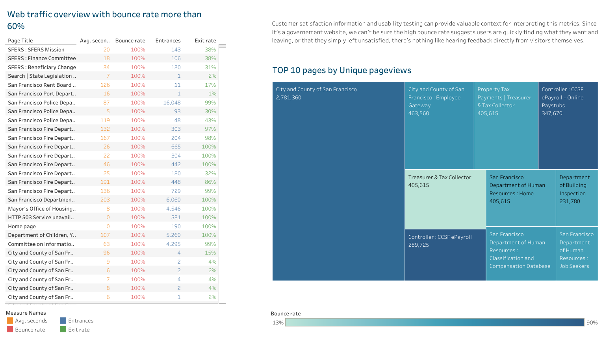

# Web analytics for San Francisco government site

- [Data sorce](https://www.kaggle.com/san-francisco/sf-web-analytics-for-sfgov-sites?select=web-analytics-for-sfgov-sites-2015-q1q2q3q4.csv)
- [Tableau Dashboard](https://public.tableau.com/app/profile/fedotova.elena/viz/WebAnalysisSF_ProjectforJunocollege/Dashboard1#1)

## Introduction 

This is a dataset hosted by the city of San Francisco. The organization has an open data platform found [here](https://datasf.org/opendata/) and they update their information according the amount of data that is brought in.  

This dataset include annual summary for each page of their website https://sf.gov/ :

-	Page title - The page titles used on website.
-	Pageviews - The total number of pages viewed. Repeated views of a single page are counted.
-	Unique Pageviews - The number of visits during which the specified page was viewed at least once.
-	Average Time on Page - The average amount of time users spent viewing a specified page or screen, or set of pages or screens.
-	Entrances - The number of times visitors entered the site through a specified page or set of pages.
-	Bounce Rate - Bounce Rate is the percentage of single-page visits (i.e. visits in which the person left the site from the entrance.
-	Exit Rate - %Exit is (number of exits) / (number of pageviews) for the page or set of pages. 

**Buisness problem**

Bounce rate is a great metric to keep track of for understanding how successful the website is.
A high bounce rate might indicate that the page content is irrelevant, or confusing to the site visitors. 
The definition of “good” and “bad” scores differ from industry to industry. 
Benchmark industry standard for government websites is about 60% Bounce rate. 
Pages analysis needs to be performed before jumping into drastic actions like deleting a page or undertaking a redesigned page.

### Goal of this project

-	 Analyse bounce rate to find out how is accessible and efficient the San-Francisco government website. 

## Data Analysis 

### Technologies

- [**Google Sheets**](https://docs.google.com/spreadsheets/d/1OwhANZsj8wgisIuhHQqQTq848hQD-U7hxwKoVKuOMtA/edit?usp=sharing) for data cleaning. 
- **Tableau** was used for data visualization.

### Metrics used

- **Bounce rate** measures the percentage of people who go to a page and then leave it without visiting any other page. 
- **Exit rate** indicates where people exit the site after visiting multiple pages. 

### Research Question

-	On pages with a high bounce rate, how quickly visitors bounced? What is the average time they spent on pages?
-	Would pages with high bounce rate and exit rate have less average time spent on each page?

### Important findings

Average annual bounce rate on the website is within the industry standard, it’s 60%. 
A high bounce rate on a content page is not necessarily bad as visitors could have gotten what they needed and had no need to continue. 
The main page of the website got 81% Bounce rate, 75% Exite Rate which is high but could be explained.
The main page refer visitors to other government websites and provides information. In gereral visitors spent there 215seconds, 3,5min.
In this case, the webpage successfully served its purpose even though visitors viewed one page.

At the same time, I found average time spend on pages quete high. Do visitors find what they looking for quickly?

## Recommendations

Customer satisfaction information and usability testing can provide valuable context for interpreting this metrics. 
Since it's a governement website, we can't be sure the high bounce rate suggests users are quickly finding what they want and leaving, or that they simply left unsatisfied, 
there’s nothing like hearing feedback directly from visitors themselves.

For collecting data about visitor experience improvement I would suggest asking users directly. For Example,

-	Do visitors find the information they are looking for?
-	Do vsitors actually reading the information on the website?
-	How long does it take for someone to find the information they require?
-	How often do visitors return to the website? 

It is an opportunity to make informed decisions on improvements to this government web site to reflect the voice of the visitor and get constituents what they need.